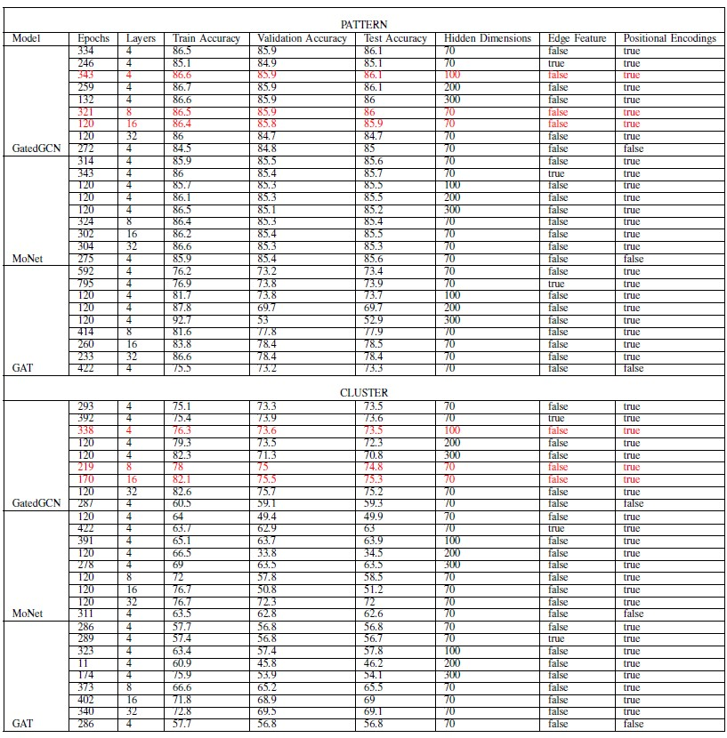

# Towards-End-to-End-Compute-Graph-Optimization-with-Graph-Neural-Networks
This project is about finding the best model and parameter configuration for the node classification task by comparing the accuracy. 
Machine learning models are constantly growing in terms of complexity and there is a massive growth in the computational demands required for training and inference of
the neural networks in last few years. We can optimise the models only upto certain extent to run them faster. But to get faster execution, we can optimize the device placement of the computational graphs of the machine learning models.At present it’s done by having a heterogeneous distributed environment consisting of a mixture of hardware devices such as CPUs and GPUs where human experts do the placement based on simple heuristics and intuitions. In this paper, we start to research on how to optimize machine learning model’s execution time by training a model for node classification for device placement. First we find the best model for node classification trained on a synthetic graph dataset and then, in future work, we seek to use the model identified to train for device placement task on the dataset having machine learning models. GatedGCN is the most competitive model among the models it is compared with i.e. MoNET and GAT. Because of which, we recommend its use for the follow-up work.  

Models compared: 
1)GatedGCN 
2)GAT 
3)MoNet  
Results: 

